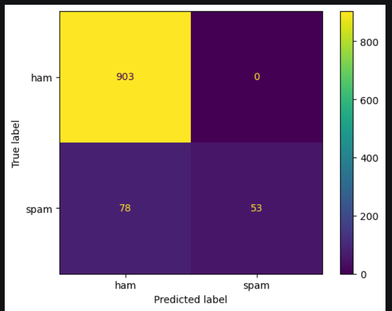
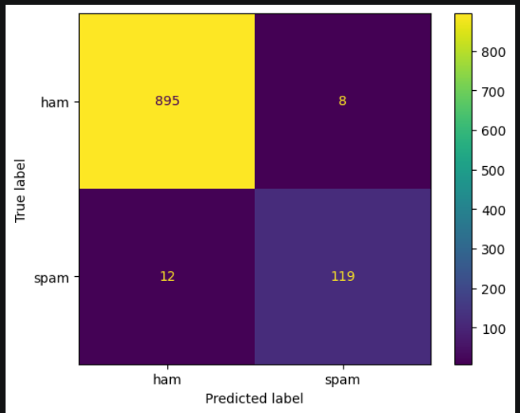
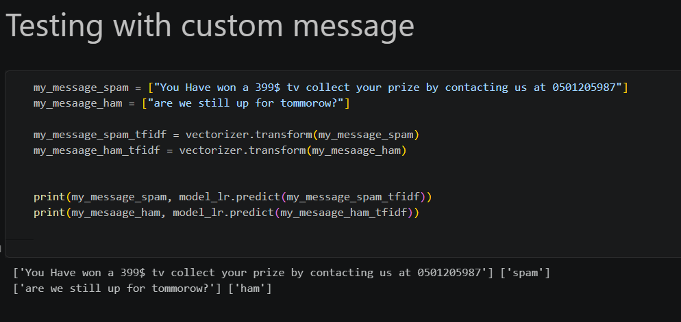

Data source: https://www.kaggle.com/datasets/uciml/sms-spam-collection-dataset
---
* Used TF-IDF vectorizer to convert raw text to a matrix of features.

* First, I fed it to the KNN algorithm, but obviously it will suffer from the curse of dimensionality.

*Confusion Matrix for 5-NN with weights="distance" (so closer neighbors have more influence on the prediction)).

---

* Then the main algorithm, which is Logistic Regression, actually works pretty nicely despite the relatively small dataset.

* After cross-validation, it appears that C=100 is the right parameter to use.

* class_weight="balanced" solves our data imbalance by giving more weight to the minority class of spam.

              precision    recall  f1-score   support

        spam       0.94      0.91      0.92       131

      accuracy                           0.98      1034

ROC-AUC = 0.9900416761769504

So even with different thresholds, our model still separates the two classes very well.

---
Logistic Regression performed much better than KNN on the high-dimensional TF-IDF features
---

